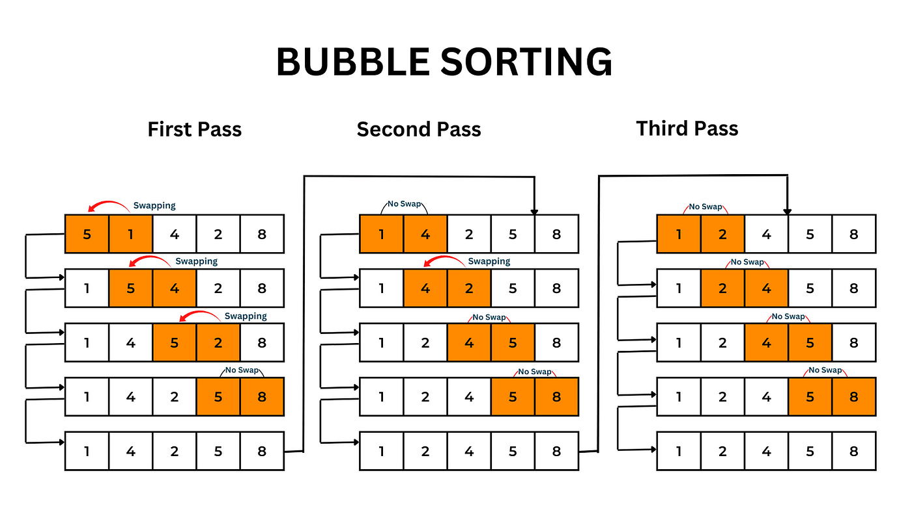

# Problem: Bubble Sort

- Platform: GFG
- Link: https://www.geeksforgeeks.org/problems/bubble-sort/1
- Difficulty: Easy
- Tags: Sorting, Algorithms

## Problem Statement

Given an array, arr[]. Sort the array using bubble sort algorithm.

## Example

```
Input: arr[] = [4, 1, 3, 9, 7]
Output: [1, 3, 4, 7, 9]
```

## Approach

- Repeatedly swap adjacent elements if they are in wrong order
- for each round in array
- traverse through the array to find elements in wrong order and swap
- repeat rouds to cover the array
- when no swap is needed, array is sorted



### Time complexity

- Time: `O(N^2)`
- Space: `O(1)`

### Code (C++)

```c++
void bubbleSort(vector<int>& arr) {
  // Your code here
  int n = arr.size();
  for(int i=0 ; i<n-1 ; i++){ // rounds
    bool swapped=false; // check if swap happened for the round
    for(int j=0 ; j<n-i-1 ; j++){
      if(arr[j]>arr[j+1]){
        int temp = arr[j];
        arr[j]=arr[j+1];
        arr[j+1]=temp;
        swapped=true; // if swap set it to true
      }
    }
    if(swapped==false){ // if no swap happened in traversal
      break; // array is sorted now break all loops
    }
  }
}
```
