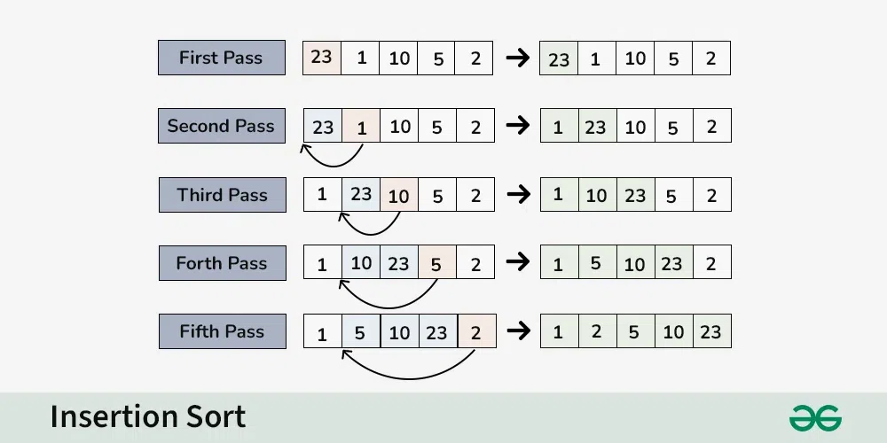

# Problem: Insertion Sort

- Platform: GFG
- Link: https://www.geeksforgeeks.org/problems/insertion-sort/1
- Difficulty: Easy
- Tags: Sorting, Algorithms

## Problem Statement

The task is to complete the insertsort() function which is used to implement Insertion Sort in array.

## Example

```
Input: arr[] = [4, 1, 3, 9, 7]
Output: [1, 3, 4, 7, 9]
```

## Approach

- Iterate over array
- compare element with predecessor
- if predecessor greater, swap with current
- compare again till predecessor greater



### Time complexity

- Time: `O(N^2)`
- Space: `O(1)`

### Code (C++)
```c++
void insertionSort(vector<int>& arr) {
  // code here
  int n = arr.size();
  for(int i=1 ; i<n ; i++){
    int key=arr[i];
    int j=i-1;
    while(j>=0 && arr[j]>key){
      // swap but since we already saved as key, we place key at the end
      arr[j+1] = arr[j];
      j=j-1;
    }
    arr[j+1]=key;
  }
}
````
