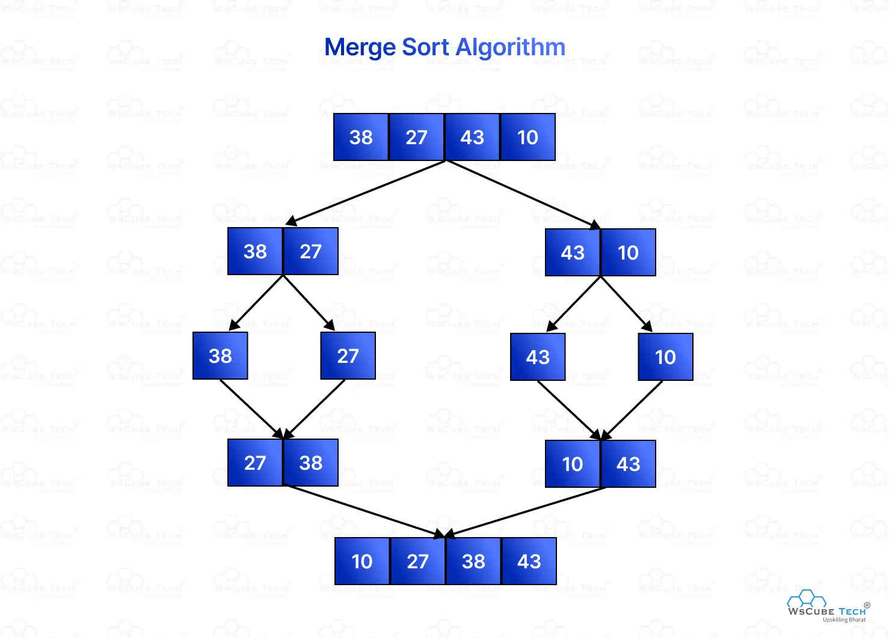

# Problem: Merge Sort

- Platform: GFG
- Link: https://www.geeksforgeeks.org/problems/merge-sort/1
- Difficulty: Easy
- Tags: Sorting, Algorithms, Divide and Conquer

## Problem Statement

Given an array arr[], its starting position l and its ending position r. Sort the array using the merge sort algorithm.

## Example

```
Input: arr[] = [4, 1, 3, 9, 7]
Output: [1, 3, 4, 7, 9]
```

## Approach

- Divide array in two parts
- Sort the two parts
- merge them together
- merge: 
  - copy the two parts in new arrays
  - pointers at 0 of new arrays
  - compare the elements, insert smaller in array
  - move that pointer forward
  - if any array finishes, insert remaining elements of other array in order




### Time complexity

- Time: `O(nlogn)`
- Space: `O(n)`

### Code (C++)
```c++
void merge(vector<int>& arr, int l, int mid , int r){
      int n1 = mid-l+1; // size of first part
      int n2 = r-mid; // sie of second part
      
      int* a1 = new int[n1]; // Left array
      int* a2 = new int[n2]; // right array
      // copy elements to both array
      for(int i=0 ; i<n1 ; i++){
          a1[i]=arr[l+i];
      }
      for(int i=0 ; i<n2 ; i++){
          a2[i]=arr[mid+1+i];
      }
      // lets sort
      int i=0 , j=0 , k=l;
      while(i<n1 && j<n2){
          if(a1[i]<a2[j]){
              arr[k]=a1[i];
              k++;
              i++;
          }
          else{
              arr[k]=a2[j];
              k++;
              j++;
          }
      }
      while(i<n1){
          arr[k]=a1[i];
          k++;
          i++;
      }
      while(j<n2){
          arr[k]=a2[j];
          k++;
          j++;
      }
      // delete the temporary arrays
      delete[] a1;
      delete[] a2;
      
  }
    void mergeSort(vector<int>& arr, int l, int r) {
        // code here
        if(l>=r){
            return;
        }
        int mid = l + (r-l)/2;
        mergeSort(arr, l, mid);
        mergeSort(arr, mid+1, r);
        merge(arr, l , mid , r);
    }
```