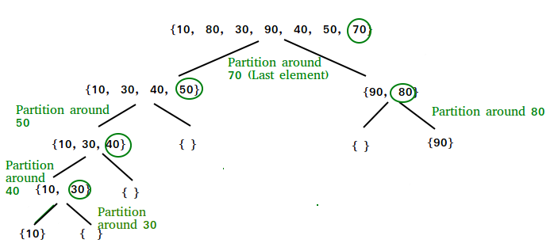

# Problem: Quick Sort

- Platform: GFG
- Link: https://www.geeksforgeeks.org/problems/merge-sort/1
- Difficulty: Easy
- Tags: Sorting, Algorithms, Divide and Conquer

## Problem Statement

Implement Quick Sort, a Divide and Conquer algorithm, to sort an array, arr[] in ascending order. Given an array, arr[], with starting index low and ending index high, complete the functions partition() and quickSort(). Use the last element as the pivot so that all elements less than or equal to the pivot come before it, and elements greater than the pivot follow it.

## Example

```
Input: arr[] = [4, 1, 3, 9, 7]
Output: [1, 3, 4, 7, 9]
```

## Approach

- Using hoare's partition
- start from both ends
- compare left `elements < pivot`
- compare right `elements>pivot`
- if not swap right and left
- if `i>=j` return j (pivot)




### Time complexity
- Time: Avg: `O(nlogn)` Worst: `O(n)`
- Space: `O(1)`

### Code (C++)
```c++
class Solution {
  public:
    // Function to sort an array using quick sort algorithm.
    void quickSort(vector<int>& arr, int low, int high) {
        if(low<high){
            int p = partition(arr, low, high);
            quickSort(arr, low, p);
            quickSort(arr, p+1, high);
        }
    }

  public:
    int partition(vector<int>& arr, int low, int high) {
        int pivot = arr[low];
        int i = low-1, j=high+1;
        while(true){
            do{
            i++;
            } while(i<=high && arr[i]<pivot);
        
            do{
                j--;
            }while(j>=low && arr[j]>pivot);
        
            if(i>=j){
                return j;
            }
            int temp=arr[i];
            arr[i]=arr[j];
            arr[j]=temp;
        }
    }
};
```