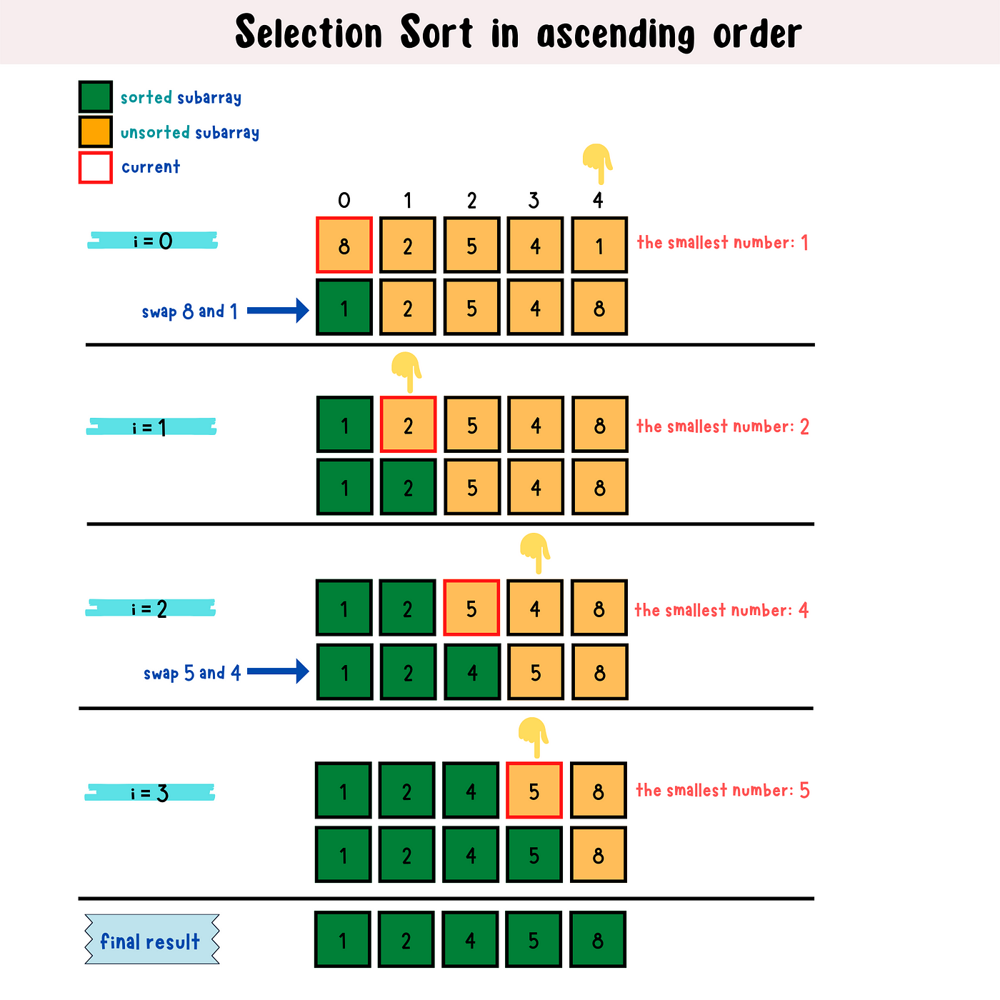

# Problem: Selection Sort

- Platform: GFG
- Link: https://www.geeksforgeeks.org/problems/selection-sort/1
- Difficulty: Easy
- Tags: Sorting, Algorithms

## Problem Statement

Given an array arr, use selection sort to sort arr[] in increasing order.

## Example

```
Input: arr[] = [4, 1, 3, 9, 7]
Output: [1, 3, 4, 7, 9]
```

## Approach

- Repeatedly find minimum element in unsorted part and replace it at the beginning
- for the whole array, repeat rounds
- find minimum in unsorted part
- swap with beginning index



### Time complexity

- Time: `O(N^2)`
- Space: `O(1)`

### Code (C++)

```c++
void selectionSort(vector<int> &arr) {
  // code here
  int n=arr.size();
  for(int i=0 ; i<n-1 ; i++){
    int min=i;
    for(int j=i+1 ; j<n ; j++){
      if(arr[j]<arr[min]){
        min=j;
      }
    }
    // swap
    int temp = arr[i];
    arr[i]=arr[min];
    arr[min]=temp;
  }
}
```
