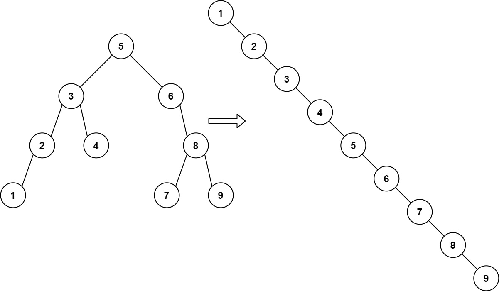

# Problem: Inorder search tree

- Platform: Leetcode 897
- Link: https://leetcode.com/problems/increasing-order-search-tree/description
- Difficulty: Easy
- Tags: Stack, Tree, DFS, BFS, Binary Tree

## Problem Statement
Given the root of a binary search tree, rearrange the tree in in-order so that the leftmost node in the tree is now the root of the tree, and every node has no left child and only one right child.


## Example

```
Input: root = [5,3,6,2,4,null,8,1,null,null,null,7,9]
Output: [1,null,2,null,3,null,4,null,5,null,6,null,7,null,8,null,9]
```


## Approach 1
- create inorder traversal of current tree
- this gives increasing order array
- constructe a right skewed tree from it

### Time complexity
- Time: `O(n)` 
- Space: `O(n)`

### Code (C++)
```c++
class Solution {
public:
    TreeNode* increasingBST(TreeNode* root) {
        vector<int>nodes;
        inorder(root, nodes);
        TreeNode* node = new TreeNode(nodes[0]);
        TreeNode* temp = node;
        for(int i=1 ; i<nodes.size() ; i++){
            node->right = new TreeNode(nodes[i]);
            node=node->right;
        }
        return temp;
    }
private:
    void inorder(TreeNode* root, vector<int>&nodes){
        if(root==NULL){
            return;
        }
        inorder(root->left, nodes);
        nodes.push_back(root->val);
        inorder(root->right, nodes);
    }
};
```
