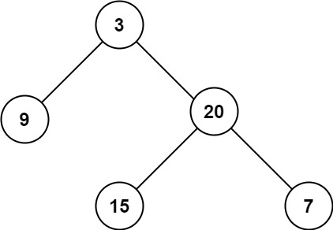
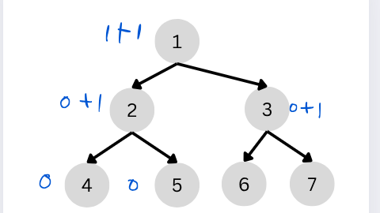

# Problem: Maximum depth of binary tree

- Platform: Leetcode 104
- Link: https://leetcode.com/problems/maximum-depth-of-binary-tree
- Difficulty: Easy
- Tags: Tree, DFS, BFS, Binary Tree

## Problem Statement
Given the root of a binary tree, return its maximum depth.

A binary tree's maximum depth is the number of nodes along the longest path from the root node down to the farthest leaf node.



## Example
```
Input: root = [3,9,20,null,null,15,7]
Output: 3
```

## Approach 1
- DFS recursive approach
- from the leaf you count the depth
- if root is null = return 0
- else for each root find left and right depth
- return max of depth+1 (for the current depth)
- depth can also be referred to as levels, or maximum height of tree


### Time complexity
- Time: `O(n)` 
- Space: `O(h)`

### Code (C++)
```c++
class Solution {
public:
    int maxDepth(TreeNode* root) {
        if(root==NULL){
            return 0;
        }
        int h1=maxDepth(root->left);
        int h2=maxDepth(root->right);
        return max(h1,h2)+1;
    }
};
```
